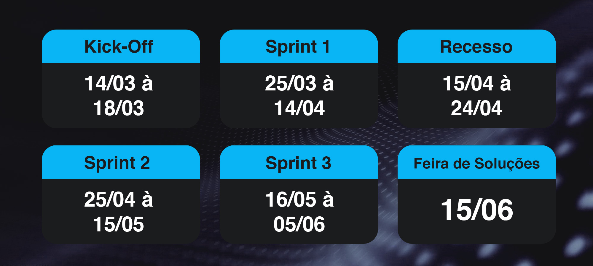
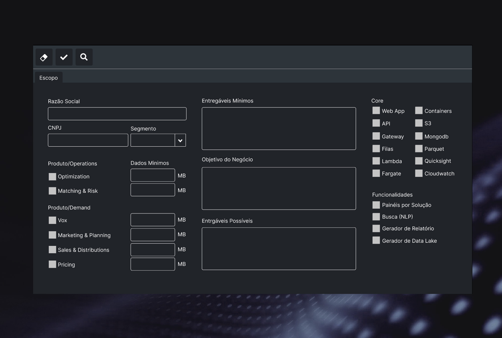
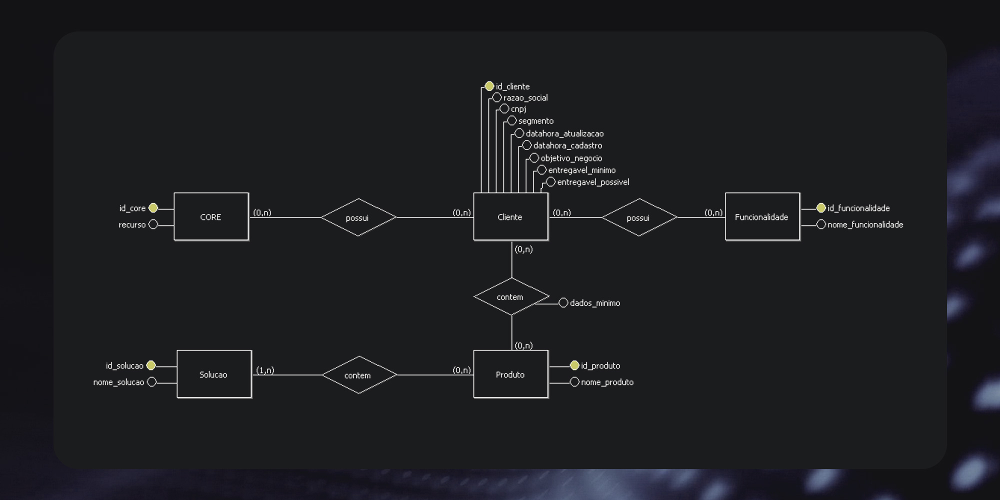

      

  <a href="https://github.com/fluffyfatec/Dom_Rock#%EF%B8%8F-desafio">SOBRE</a> •
  <a href="#credits">CRONOGRAMA</a> •
  <a href="#related">PROPOSTA</a> •
  <a href="#license">BACKLOG</a> •
  <a href="#license">METAS</a> •
  <a href="#license">BURNDOWN</a> •
  <a href="#license">WIREFRAME</a> •
  <a href="#license">EQUIPE</a> •
  <a href="#license">TECNOLOGIA</a>

## Desafio
Desenvolver uma solução na gestão de ativação do cliente na plataforma Dom Rock.

A empresa busca uma solução que seja orientada a entrada de dados de parâmetros e variáveis de cada cliente para alocar recursos na plataforma Dom Rock, entrada de dados e estimativa de consumo de recursos (baseado em volume de dados de cliente, quantidade de usuários e outros) e gere relatórios e consultas, mas, principalmente, tenha a base de dados modelada adequadamente para futuras integrações com outros sistemas.

(<a href="#top">voltar ao topo</a>)

## Objetivo

Requisitos Funcionais

• Cadastros de Clientes

• Cadastro de módulos/soluções Dom Rock

• Cadastro das etapas de ativação: bronze, silver, gold, distribuição, bp, core, segurança
(cada etapa tem uma lista de recursos e definições associados – lista de itens e variáveis
de ambiente que a plataforma usa – são todos fixos e pre-definidos)

• Cadastro de ativação de clientes (que une clientes, solução e etapas)

• Cadastro de volume de recursos (fontes de dados, tamanho, quantidade de usuários) para
cada cliente

• Cadastro de usuários do Cliente

• Usuários da aplicação devem ter perfis diferentes (administrador, suporte, cliente)

• Cadastro de comentários/soluções/sugestão de melhorias para problemas conhecidos ou
encontrados durante a ativação de cada cliente

• Consultas e relatórios por cliente, por solução Dom Rock ativada, etapa, dentre outros
fatores.

Requisitos Não Funcionais

• Módulo de login/autenticação e perfil

• Utilizar em servidor/ambiente Linux

(<a href="#top">voltar ao topo</a>)

## Solução
A Fluffy API desenvolveu o Sistema de Gerenciamento de Clientes - Dom Rock, uma aplicação desktop desenvolvida em Java utilizando um banco relacional para cadastrar e armazenar o dados do briefing dos clientes.

Além de cadastrar, também ira possuir a função de consulta, edição, relatórios, logs e exportação. Não esquecendo dos usuários com níveis de acessos definidos para maior segurança dos dados na plataforma.

(<a href="#top">voltar ao topo</a>)

## Cronograma

      

(<a href="#top">voltar ao topo</a>)

## Proposta do Projeto

(<a href="#top">voltar ao topo</a>)

## Backlog do Produto

      

(<a href="#top">voltar ao topo</a>)

## Metas das Sprints

(<a href="#top">voltar ao topo</a>)

## Burndown 

      

(<a href="#top">voltar ao topo</a>)

## Wireframe

      

(<a href="#top">voltar ao topo</a>)

## DER - Escopo

      

(<a href="#top">voltar ao topo</a>)

## Como instalar o programa?

Nosso banco de dados se encontra na nuvem da Azure (SQL Server) e como forma de segurança pedimos para enviar um email com o seu [IP Externo](http://www.meuip.com/) para o nosso email fluffyapi@gmail.com (enviar nome e IP) que iremos liberar o acesso para a utilização da aplicação.

(<a href="#top">voltar ao topo</a>)

## Equipe

| Avatar            							| Aluno         | Função           		| GitHub                                                      | LinkedIn                                              |
| -------------------------------------------- | ---------------- | ---------------- | -------------------------------------------------------------- | ----------------------------------------------------- |
| |__Victor Fernandes__  | *Scrum Master*  | |  |
| |__Felipe Sobral__  | *Product Owner*  | |  |
| |__Patrick Souza__  | *Developer Team* |   |  |
| |__Ana Clara Leal__| *Developer Team* |       |  |
| |__Luiz Felipe Borges__ | *Developer Team* |    |  |
| |__Tiago Camillo__| *Developer Team*|  |  |
| |__Aldrik Álvaro__| *Developer Team*|  |  |
| |__Emanuele Diniz__| *Developer Team*|  |  |

(<a href="#top">voltar ao topo</a>)

## Tecnologias Utilizadas

Front-End

* [Figma](https://www.figma.com/)

* [JavaFX Scene Builder 3](https://www.oracle.com/java/technologies/javafxscenebuilder-1x-archive-downloads.html)

Back-End

* [Java](https://www.java.com/pt-BR/?msclkid=7faa842eb8f811ecab39772d4c1ae90b)

* [Eclipse IDE](https://www.eclipse.org/downloads/)

* [IntelliJ IDE](https://www.jetbrains.com/idea/promo/?msclkid=6ae44e88c2811d86c0ae2cdbd94ffcfb&utm_source=bing&utm_medium=cpc&utm_campaign=AMER_en_BR_IDEA_Branded&utm_term=intellij&utm_content=intellij%20idea)

Banco de Dados

* [SQL Server Nuvem Azure](https://azure.microsoft.com/pt-br/services/sql-database/campaign/)

Outros

* [Github](https://github.com/)

* [Discord](https://discord.com/?msclkid=b4f5af84b8f811ecbd81c127a0ae68a7)

* [Slack](https://slack.com/intl/pt-br/?msclkid=c00e628eb8f811ecaef374bb86d7f056)

* [Jira](https://www.atlassian.com/br/software/jira?msclkid=c8e971f7b8f811ec957d13ca3bfc6c1b)

* [Photoshop](https://www.adobe.com/br/products/photoshop.html?sdid=KQPOM&mv=search&ef_id=d67181c6b224183a4875e395ae54f4bf:G:s&s_kwcid=AL!3085!10!79302406606568!79302288716688&msclkid=d67181c6b224183a4875e395ae54f4bf)

(<a href="#top">voltar ao topo</a>)

      

---

> GitHub [@amitmerchant1990](https://github.com/fluffyfatec) &nbsp;&middot;&nbsp;
> Gmail [@amit_merchant](https://is.gd/fluffyfatec)
