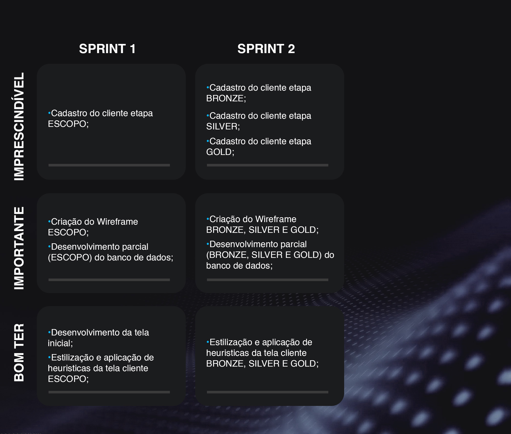
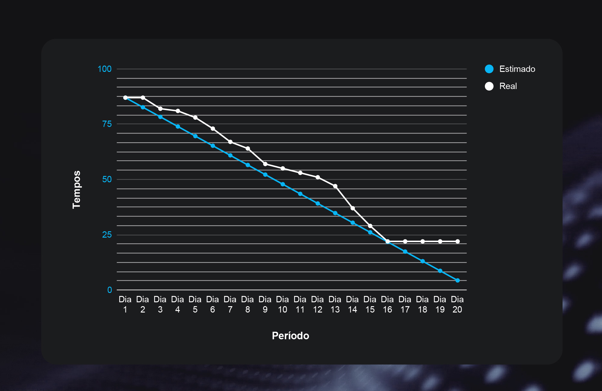

      

  <a href="https://github.com/fluffyfatec/Dom_Rock#%EF%B8%8F-desafio">SOBRE</a> •
  <a href="#credits">CRONOGRAMA</a> •
  <a href="#related">PROPOSTA</a> •
  <a href="#license">BACKLOG</a> •
  <a href="#license">METAS</a> •
  <a href="#license">BURNDOWN</a> •
  <a href="#license">WIREFRAME</a> •
  <a href="#license">EQUIPE</a> •
  <a href="#license">TECNOLOGIA</a>

## Desafio
Desenvolver uma solução na gestão de ativação do cliente na plataforma Dom Rock.

A empresa busca uma solução que seja orientada a entrada de dados de parâmetros e variáveis de cada cliente para alocar recursos na plataforma Dom Rock, entrada de dados e estimativa de consumo de recursos (baseado em volume de dados de cliente, quantidade de usuários e outros) e gere relatórios e consultas, mas, principalmente, tenha a base de dados modelada adequadamente para futuras integrações com outros sistemas.

## Objetivo
### Requisitos Funcionais:

• Cadastros de Clientes

• Cadastro de módulos/soluções Dom Rock

• Cadastro das etapas de ativação: bronze, silver, gold, distribuição, bp, core, segurança
(cada etapa tem uma lista de recursos e definições associados – lista de itens e variáveis
de ambiente que a plataforma usa – são todos fixos e pre-definidos)

• Cadastro de ativação de clientes (que une clientes, solução e etapas)

• Cadastro de volume de recursos (fontes de dados, tamanho, quantidade de usuários) para
cada cliente

• Cadastro de usuários do Cliente

• Usuários da aplicação devem ter perfis diferentes (administrador, suporte, cliente)

• Cadastro de comentários/soluções/sugestão de melhorias para problemas conhecidos ou
encontrados durante a ativação de cada cliente

• Consultas e relatórios por cliente, por solução Dom Rock ativada, etapa, dentre outros
fatores.

### Requisitos Não Funcionais:

• Módulo de login/autenticação e perfil

• Utilizar em servidor/ambiente Linux

## Solução
A Fluffy API desenvolveu o Sistema Gerenciador de Clientes Dom Rock, uma aplicação desktop desenvolvida em Java utilizando um banco relacional para cadastrar e armazenar o briefing dos clientes.

## Proposta do Projeto

## Backlog do Produto

      

## Metas das Sprints

## Burndown 

      

## Wireframe

## Equipe

| Avatar            							| Aluno         | Função           		| GitHub                                                      | LinkedIn                                              |
| -------------------------------------------- | ---------------- | ---------------- | -------------------------------------------------------------- | ----------------------------------------------------- |
| |__Victor Fernandes__  | *Scrum Master*  | |  |
| |__Felipe Sobral__  | *Product Owner*  | |  |
| |__Patrick Souza__  | *Developer Team* |   |  |
| |__Ana Clara Leal__| *Developer Team* |       |  |
| |__Luiz Felipe Borges__ | *Developer Team* |    |  |
| |__Tiago Camillo__| *Developer Team**|  |  |
| |__Aldrik Álvaro__| *Developer Team**|  |  |
| |__Emanuele__| *Developer Team**|  |  |

## Tecnologias Utilizadas
